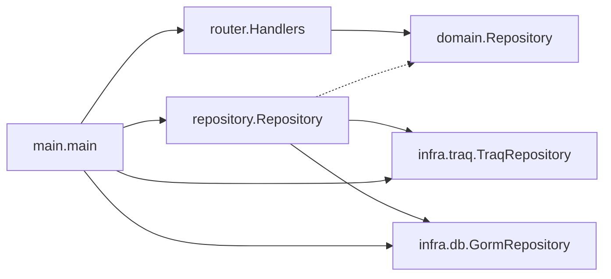

# 開発者用ノート (日本語版)

[toc]

## 開発環境

GoとDocker (Docker Compose) がインストールされていれば開発を行うことができます

```bash
docker compose up
```

を実行すると以下の環境が起動します

- knoQアプリ (フロントエンドを含みます)
  - <http://localhost:6006>
- DB(MariaDB)
- DB接続クライアント(PHPMyAdmin)
  - <http://localhost:8000>

> **Info**
> 代わりに以下のコマンドを実行することで、ソースコードの変更を検知して自動で再起動させることができます
> 参考: [Compose Watch](https://docs.docker.com/compose/file-watch/)
>
> ```bash
> docker compose watch
> ```

## ディレクトリ構造

2023/08現在でディレクトリ構造は以下のようになっています
構造が大きく変わったら適宜更新してください

```bash
$ tree -d | modificate-manually
.
├── docs
├── (main.go) # エントリーポイント
├── domain # ドメイン構造体とそれらをやり取りするRepositoryインターフェイス
│   └── filter # GroupやEventの検索クエリを構築するための型定義
├── infra # 外部サービスとの最低限の通信を記述する
│   ├── db # Gormを用いたDBアクセス
│   ├── google # Googleでログインするための機構。今は使われていない
│   └── traq # traQへのAPIアクセス
├── migration # DBマイグレーション。テーブル定義などの変更はここで行う
├── repository # domain.Repositoryインターフェイスの実装
├── router # echoを用いたルーティング処理
│   ├── logging # ルーティング用カスタムzapロガー
│   └── presentation # APIスキーマ定義、クエリ処理
└── utils # 汎用関数
    ├── parsing # filterのパース処理
    └── random # ランダム値生成
```

## 依存関係

大まかな依存関係は以下のようになっています
実線が依存、点線が実装を表しています



## 各パッケージの役割

### main

エントリーポイントである`func main()`が定義されています
infraやrepositoryから`router.Handler`を組み立て、サーバーを開始しています
環境変数や各構造体の初期化を行っていますが、肥大化したらconfigパッケージを作ったりセットアップ関数を各パッケージに移すと良いかもしれません

### domain

コアとなるドメイン構造体が定義されています
routerとrepositoryはドメイン構造体を介してやり取りを行います

repositoryの処理は`domain.Repository`インターフェイスで抽象化されています
インターフェイスはrepositoryパッケージで実装されています

#### domain/filter

GroupやEventの検索クエリを構築するための型定義が定義されています
ここでは属性や演算子の定義のみを行い、実装はinfra/dbパッケージで行っています

### repository

`repository.Repository`が`domain.Repository`を実装するように書かれています
infra/dbの`GormRepository`とinfra/traqの`TraQRepository`経由でDBやtraQとやり取りを行い、domainを構築しています

### router

echoを用いたAPIサーバーのルーティング処理が定義されています
エンドポイントはdocs/swagger.yamlのOpenAPI定義に従います
各エンドポイントのハンドラーは`router.Handlers`のメソッドとして実装されています

#### router/logging

ルーティング用のカスタムzapロガーが定義されています
`zapcore.ObjectMarshaller`を満たすように実装されています

#### router/presentation

APIスキーマ定義とクエリ処理が定義されています

### infra

DBやtraQ APIなど外部サービスとの通信を記述しています
外部サービスごとにパッケージを分け、そのサービスに依存する実装をここで書いています

#### infra/db

Gormを用いたDBアクセスが定義されています
最低限のCRUD処理を行っています

#### infra/google

Googleでログインするための機構が定義されています
将来OSS化した際に使用予定です

#### infra/traq

traQへのAPIアクセスが定義されています
traQのAPI仕様に合わせて実装されています

### utils

汎用的な関数が定義されています
ユースケースが限定されるときはなるべく適したパッケージに移動させてください

#### utils/parsing

filterのパース処理が定義されています
リクエストからクエリをパースし、domain/filterで定義した型に変換します

#### utils/random

ランダム生成に使います
